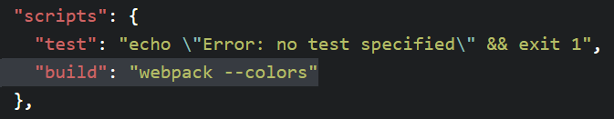

## 介绍 ##

> 这是一个阶段性学习 webpack 的实验教程，这篇介绍目的是帮你快速上手 webpack，所以没有详细介绍 webpack，想要更多地了解 webpack，可以参考文章：[webpack常规配置总结](https://github.com/WeiJietao/LogBase/blob/master/webpack%E5%B8%B8%E8%A7%84%E9%85%8D%E7%BD%AE%E6%80%BB%E7%BB%93.md)

### 下载模块 ###

在每个 state 目录下开启命令窗口，使用`npm install`命令(建议使用淘宝镜像，可以大大提高下载速度，下载模块命令变为`cnpm install`)自动根据 package.json 文件的 devDependencies 和 dependencies 项下载模块。

### 启动 ###

package.json 文件中 scripts 项中自定义了可以执行的命令，如图：



在命令窗口下执行`npm run build`命令即可使用 webpack 打包资源。

---

```
POST_DATE       : 2017/08/11
RECENTLY_MODIFY : 2017/08/19
```
